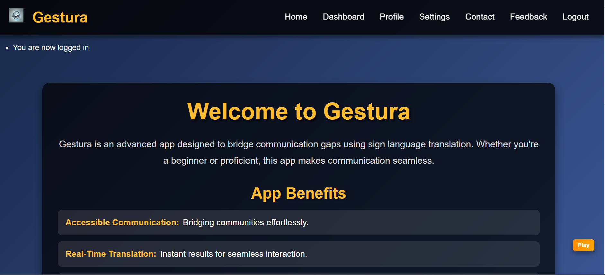
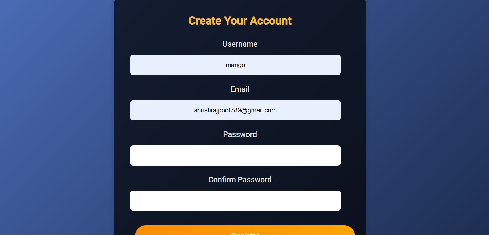
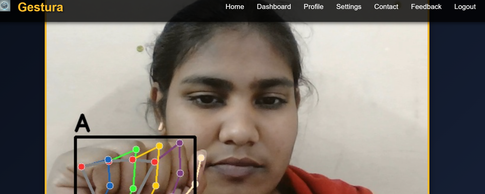
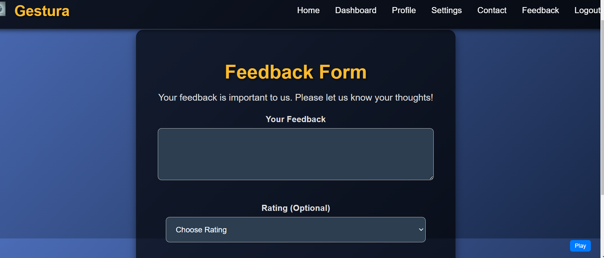
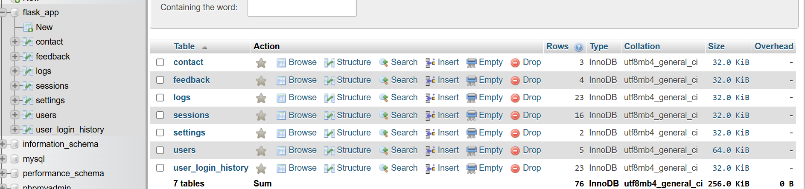

# Gestura: AI-Powered Sign Language Translation
This project aims to create a sign language translator using machine learning techniques and Python programming. The application utilizes various modules, primarily Mediapipe, Landmark, and Random Forest algorithms to interpret and translate sign language gestures into text or spoken language.

## Project Overview
Sign language is a crucial form of communication for individuals with hearing impairments. This project focuses on bridging the communication gap by creating a tool that can interpret sign language gestures in real-time and convert them into understandable text or speech.
  
## Features
 - Real-time sign language recognition: Captures hand gestures using the Mediapipe library to track landmarks and movements.
 - Landmark analysis: Utilizes Landmark module to extract key points and gestures from hand movements.
 - Machine learning translation: Employs Random Forest algorithm to classify and interpret gestures into corresponding text or spoken language.
  
## Usage
  1. Installation:
  ```
   #Clone the repository
   git clone https://github.com/Shristirajpoot /Gestura.git
   
   #Navigate to the project directory
   cd sign-language-detector-flask-python
  ```
  
  2. **Install the required dependencies** using the following command:

  ```bash
    pip install -r requirements.txt
  ```
   
  3. Run the application:
  ```
   python app.py
  ```
   
  3. Interact with the translator :
   - Activate the camera for real-time gesture recognition.
   - Perform sign language gestures in front of the camera.

## Screenshots
  ### Home Page


  ### About Page


  ### ASL Language

  ### Dashboard Page
 
  ### Feedback Page
 

  ### tables 
   
## Contributing
 Contributions are welcome! If you'd like to contribute to this project, feel free to open issues, create pull requests, or reach out to discuss potential improvements.
